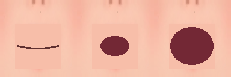

# 表情・瞬き 実装と検証記録

現在の状態: **実装と機械検証は完了。見た目と拍同期の人手確認は未実施（不明）。**

通常瞬きが強制瞬きの終了と重なる場合の開眼遅延と、口0をベイク下地から閉口へ加工する方針はユーザー承認済み。設計の結論を `docs/design.md` に統合し、実装用specは削除した。



## 1. 純関数と TDD

```sh
tools/unity.sh test EditMode 40
uv run tools/verify_face_score_mutations.py
```

初回の stub 実装は **40件中30成功・10失敗**。本実装は **40/40 Passed**。`tdd-red.xml` と `tdd-green.xml` を同梱している。フィクスチャは表情1、列3、行2、T=8、J=4。−2拍からの走査に加え、通常瞬きが実際に発火する負の周期を固定ベクトルで検査する。

8種類それぞれで実装ファイルを変更し、指定テストの失敗をXMLで確認し、元の実装へ戻して40/40成功を確認した。記録は [mutations.json](face-expression/mutations.json)。スクリプトの現在の期待件数は、後続のFaceDirectorテスト2件を含む42件である。

| 変異 | 対象テスト | 失敗件数 | 復元後 |
| --- | --- | ---: | --- |
| J=0 | BlinkIntervalsHaveNonzeroVariance | 5 | 40/40 |
| 瞬きの発火条件を無効化 | BlinkFiresOncePerPeriodAcrossThousandBeats | 7 | 40/40 |
| 閉眼0.3→0.2拍 | EveryBlinkHasPointThreeBeatsOfClosedEyes | 2 | 40/40 |
| 負拍のfloorを整数切り捨てに変更 | NegativeBeatsUseFloorAndKeepMouthPhase | 1 | 40/40 |
| アトラスの行を逆転 | AtlasRowsAreTopToBottomForEveryFrame | 1 | 40/40 |
| 強制瞬きの位相代入を削除 | SwitchingForcesSharedBlinkImmediately | 2 | 40/40 |
| 瞬きの結果をexpressionで上書き | ExpressionsChangeOnlyOpenEyes | 7 | 40/40 |
| 口の終端分岐0を範囲外の3に変更 | MouthAlwaysStaysInItsThreeFrames | 3 | 40/40 |

口は0/1/2の直接選択であり、不要なclampは持たない。そのため「範囲ガードの削除」に相当する故障は、終端分岐の範囲外出力として注入している。ガード削除そのものを行ったとは扱わない。

測定出力:

```text
blink starts [-2,1000]=125
blink interval min=4.2620000000000573 max=11.636999999999944
mouth frame counts=651159,200000,150842
```

各発火の閉眼幅は0.001拍刻みで測定し、0.300±0.002拍を満たす。間隔の最大と最小が異なるため分散は非ゼロである。合成順・強制瞬き・通常瞬きによる開眼遅延・口の厳密な閾値を含む。

## 2. デカールとリグ

```sh
FACE_RIG_OUTPUT=Logs/face-validation/rig-before.csv tools/unity.sh exec BabyDance.Editor.FaceAssetVerification.SnapshotRig
/opt/homebrew/bin/blender --background --factory-startup --python tools/build_face_decals.py -- --render-dir Logs/face-validation/render --bake-dir Logs/face-validation/baked
FACE_RIG_OUTPUT=Logs/face-validation/rig-after.csv tools/unity.sh exec BabyDance.Editor.FaceAssetVerification.SnapshotRig
uv run tools/verify_face_decals.py --render-dir Logs/face-validation/render-imported
uv run tools/verify_face_decals.py --measure-only --render-dir Logs/face-validation/render-imported --rig-before Logs/face-validation/rig-before.csv --rig-after Logs/face-validation/rig-after.csv
```

最終形状: 目 x±0.17 / z1.185〜1.29 / 256×128格子、口 x±0.09 / z1.08〜1.185 / 80×64格子。オフセットは法線方向0.0025。投影の未到達頂点は初期Y=-0.6で検出する。法線はData Transfer、全頂点がHeadウェイト1。

初期格子では曲面の間を平面が横切ったため密度を増やした。目と口の初期範囲は重なって口のベイクへ瞳が写り込んだため、境界をz=1.185で分離した。通常の全体FBX再出力は骨の値を約10⁻⁷ m変えたため採用していない。Blender付属のFBXコーデックを使い、生成したデカール要素だけを元のFBXへ追加し、既存の本体・骨の数値を保持する。

[全骨の往復前CSV](face-expression/rig-before.csv) / [往復後CSV](face-expression/rig-after.csv)。4クリップ×55種=220行、実際に割り当て済みなのは28本×4=112行。未割り当て骨を無言で省略せず記録し、前後の割り当て状態も比較する。各クリップ20点。

| クリップ | minBoneY 前後共通 (m) | maxBoneY 前後共通 (m) |
| --- | ---: | ---: |
| HouseDancing | -0.0391783826 | 0.461959779 |
| SlideHipHopDance | -0.010732918 | 0.462069839 |
| SnakeHipHopDance | -0.04416306 | 0.6700901 |
| TutHipHopDance | -0.0207085963 | 0.5557437 |

```text
RIG rows=220 present=112 max_abs_delta=0.0
PASS: all measured coverage/interior checks and rig equality
```

書き戻したFBXをBlenderで再読込した検証結果:

| 角度 | 基準の瞳 px | 残存 px | 4px内側の本体露出 px | 髪 px 上限 |
| --- | ---: | ---: | ---: | ---: |
| 0° | 15529 | 0 | 0 | 0 |
| -30° | 13432 | 0 | 0 | 0 |
| +30° | 13404 | 0 | 0 | 0 |
| -60° | 7239 | 0 | 0 | 0 |
| +60° | 7628 | 0 | 0 | 0 |

Cyclesの色レンダと顔の座標帯マスクを使い、角度ごとのベースラインを取得する。specの調査時の正面15423pxとは描画条件が異なるため、その値で代用せず実測15529pxを使う。髪色の閾値で除外する代わりに、デカール単独の輪郭を4px縮めた内側で非マゼンタ画素をすべて数える。これは髪以外も含む強い検査であり、0pxなら髪の貫通も0pxである。

実寸1cmの変異。Unity縮尺0.421515なので、FBX座標では0.02372394813944937だけ各側を内側へ縮める。変異FBXはLogs内に出力し、正常なアセットを上書きしない。

```sh
/opt/homebrew/bin/blender --background --factory-startup --python tools/build_face_decals.py -- --input Logs/face-validation/BabyBunny-before.fbx --output Logs/face-validation/BabyBunny-shrunk-1cm.fbx --shrink 0.02372394813944937 --render-dir Logs/face-validation/render-shrunk-1cm
uv run tools/verify_face_decals.py --measure-only --render-dir Logs/face-validation/render-shrunk-1cm
```

```text
remaining_pupil_px: 0deg=545, -30deg=536, +30deg=371, -60deg=282, +60deg=104
FAIL: pupil coverage or decal interior occlusion
exit code: 1
```

[正常形状の測定JSON](face-expression/coverage.json) / [1cm変異JSON](face-expression/shrunk-1cm.json)。FBX座標で0.01（Unity実寸4.21515mm）だけ縮める小さな変異でも、-60°で5px残って失敗した。

入力FBX SHA256: `3724ef6c6d3e0d62ee0082903a5e58a0f9cf822ad8a426862684db68d6d4d806`。

## 3. アトラス

```sh
/opt/homebrew/bin/blender --background --factory-startup --python tools/build_face_decals.py -- --verify-existing --bake-dir Logs/face-validation/baked
uv run tools/build_face_atlases.py
```

```text
BAKE FaceEyes 128x128 done
BAKE FaceMouth 128x128 done
FACE_DECALS_DONE
ATLAS FaceEyes 512x256 frames=8 core=120 padding=4 transparent_feature_px=0 padding_mismatches=0
ATLAS FaceMouth 384x128 frames=3 core=120 padding=4 transparent_feature_px=0 padding_mismatches=0
```

初回ベイクは目9px・口5pxが未取得で検査に失敗した。正面投影ケージによる再ベイクで取得し直した後、PNGの内側120×120が不透明であることを検査している。最終UV解像度128×128でベイクし、内側を縮小せず外周4pxを複製する。

目1・2・3・4・5、口0・1・2は仕上げ用の手描き差し替え対象。目0はベイクのまま、目6・7はその複製。口0はベイクの開いた口を消して閉口の線に加工する。全コマが不透明である。

```text
MOUTH dark_px closed/half/open=[199, 1248, 3556]
```

閉口を未加工ベイクへ戻す変異を `Logs/face-validation/closed-mouth-mutant.py` に作り、`uv run Logs/face-validation/closed-mouth-mutant.py` で失敗を確認した。正常スクリプトへ戻して再生成・合格した。

```text
AssertionError: Closed mouth was not reduced to a line: [1410, 1248, 3556]
exit code: 1
```

[アトラス検証出力](face-expression/atlas.log) / [閉口変異の出力](face-expression/closed-mouth-mutant.log)。

## 4. ランタイム・Editor配線

```sh
tools/unity.sh compile
tools/unity.sh test EditMode 42
tools/unity.sh exec BabyDance.Editor.AssetTools.BuildFaceMaterials
tools/unity.sh exec BabyDance.Editor.AssetTools.BuildDanceAssets
tools/unity.sh exec BabyDance.Editor.SceneBuilder.Build
tools/unity.sh exec BabyDance.Editor.FaceAssetVerification.VerifyImportedFaces
```

```text
OK compile
OK EditMode: 42/42 passed
face FaceEyes renderer=1 material=FaceEyes
face FaceMouth renderer=1 material=FaceMouth
FaceDirector ready: FaceEyes=1 FaceMouth=1
SceneBuilder.Build done: Assets/Scenes/Dance.unity dances=4
imported FaceEyes vertices=33153 HeadWeight=1 atlas=512x256 mips=10 wrap=Clamp
imported FaceMouth vertices=5265 HeadWeight=1 atlas=384x128 mips=9 wrap=Clamp
```

`FaceDirectorTests` は、両レンダラ欠落・片側欠落・名前違いの例外と、2枚の独立したUV設定、共有マテリアルの同一性を検査する。表情はHouse=1、Slide=3、Snake=2、Tut=0。DanceClipInfoの再生成後も保持される。

## 5. WebGL

```sh
tools/unity.sh build
grep -E 'error CS|Failed' Logs/build.log
```

```text
BuildWebGL result=Succeeded size=21502592 errors=0 path=/Users/fukasedaichi/git/babyDance/Builds/WebGL
BabyDance.Editor.BuildScript.BuildWebGL done
OK build
```

最終ビルドの `grep -E 'error CS|Failed' Logs/build.log` は該当0行（grep終了コード1）。成功判定はBuildReportのSucceeded・errors=0と完了マーカーに基づく。[ビルド出力](face-expression/build.log)。

```sh
uv run -m http.server 8765 --bind 127.0.0.1 --directory Builds/WebGL
# ブラウザで http://127.0.0.1:8765/ を開き、dev.logs(limit=300) を保存
grep -Eic 'exception|runtimeerror|\[error\]|abort' reports/face-expression/browser-startup.log
```

```text
startup entries=56 errors=0 warnings=1
[BabyDance] FaceDirector ready: FaceEyes=1 FaceMouth=1
exception/error/abort grep matches: 0 (exit code 1)
```

起動ログの採取範囲で例外は0件。FaceDirector初期化に加え、キャラクターとUIの描画を画面で確認した。FSR Upscaling用のシェーダー非対応警告が1件あり、警告なしとは扱わない。音楽再生中の拍同期の目視評価はこの起動確認に含めない。

[起動ログ](face-expression/browser-startup.log) / [レベル・時刻付きJSON](face-expression/browser-startup.json) / [起動画面](face-expression/browser-startup.png)。

## 人手確認と残件

- 法線転写によるライティングの継ぎ目を確認する。
- 浅い角度でデカールの縁を確認する。
- ブラウザで瞬きと口が拍に乗って見えるかを確認する。
- 仕上げ用アトラスへ差し替える。

生の実行ログと各変異のXMLは `Logs/face-validation/` にあり、主要な証拠をこのレポートと `reports/face-expression/` に同梱する。

## 変更ファイル一覧

作業開始前のspec変更を設計結論へ統合し、元specを削除した。関連アートガイドは仕上げ作業用に保持し、参照先と実寸を更新した。以下は現在の作業ツリーの変更一覧（metaを含む）。

```text
Assets/Characters/BabyBunny.fbx
Assets/Characters/BabyBunny.fbx.meta
Assets/Characters/FaceEyes.mat
Assets/Characters/FaceEyes.mat.meta
Assets/Characters/FaceEyes.png
Assets/Characters/FaceEyes.png.meta
Assets/Characters/FaceMouth.mat
Assets/Characters/FaceMouth.mat.meta
Assets/Characters/FaceMouth.png
Assets/Characters/FaceMouth.png.meta
Assets/Dance/HouseDancing.asset
Assets/Dance/SlideHipHopDance.asset
Assets/Dance/SnakeHipHopDance.asset
Assets/Dance/TutHipHopDance.asset
Assets/Editor/AssetTools.cs
Assets/Editor/BabyDance.Editor.asmdef
Assets/Editor/FaceAssetVerification.cs
Assets/Editor/FaceAssetVerification.cs.meta
Assets/Editor/SceneBuilder.cs
Assets/Scenes/Dance.unity
Assets/Scripts/DanceClipInfo.cs
Assets/Scripts/DancePlayer.cs
Assets/Scripts/FaceDirector.cs
Assets/Scripts/FaceDirector.cs.meta
Assets/Scripts/FacePose.cs
Assets/Scripts/FacePose.cs.meta
Assets/Scripts/FaceScore.cs
Assets/Scripts/FaceScore.cs.meta
Assets/Tests/EditMode/FaceDirectorTests.cs
Assets/Tests/EditMode/FaceDirectorTests.cs.meta
Assets/Tests/EditMode/FaceScoreTests.cs
Assets/Tests/EditMode/FaceScoreTests.cs.meta
LEARNINGS.md
docs/design.md
docs/superpowers/specs/2026-09-05-face-atlas-art-guide.md
docs/superpowers/specs/2026-09-05-face-expression-design.md
reports/face-expression-validation.md
reports/face-expression/atlas.json
reports/face-expression/atlas.log
reports/face-expression/browser-startup.json
reports/face-expression/browser-startup.log
reports/face-expression/browser-startup.png
reports/face-expression/build.log
reports/face-expression/closed-mouth-mutant.log
reports/face-expression/coverage.json
reports/face-expression/final-tests.xml
reports/face-expression/mutations.json
reports/face-expression/rig-after.csv
reports/face-expression/rig-before.csv
reports/face-expression/shrunk-1cm.json
reports/face-expression/tdd-green.xml
reports/face-expression/tdd-red.xml
tools/build_face_atlases.py
tools/build_face_decals.py
tools/verify_face_decals.py
tools/verify_face_score_mutations.py
```
